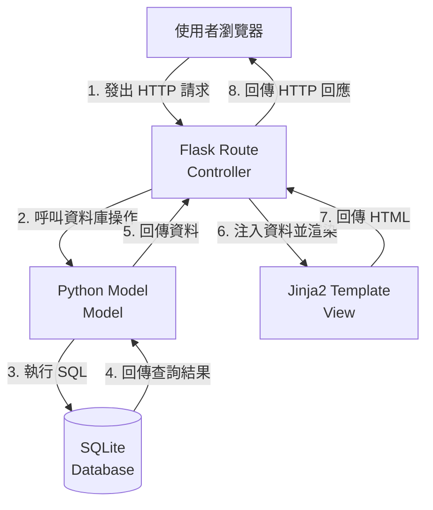

# 系統架構設計 (System Architecture)

## 1. 技術架構說明

本專案採用典型的後端渲染 (Server-Side Rendering) 網頁應用程式架構。

- **選用技術與原因**：
  - **後端：Python + Flask**  
    Flask 是一個輕量級的 Web 框架，適合快速開發小型專案。它不會強加過多限制，讓開發者能清楚掌握請求的處理流程。
  - **模板引擎：Jinja2**  
    Jinja2 是 Flask 內建的模板引擎，能在後端將 Python 資料動態嵌入 HTML 中，不需要額外撰寫複雜的前端 API 請求與狀態管理。
  - **資料庫：SQLite**  
    SQLite 是一個無伺服器的輕量關聯式資料庫，資料存放在本地單一檔案中，無需繁雜的環境設定，非常適合用作 MVP 版本的資料儲存。

- **Flask MVC 模式說明**：
  儘管 Flask 沒有強制規定使用 MVC (Model-View-Controller) 架構，但我們仍依循此概念來組織程式碼：
  - **Model (模型)**：負責與 SQLite 資料庫溝通，處理資料的儲存、查詢與更新。
  - **View (視圖)**：Jinja2 模板與前端靜態資源，負責資料的呈現與 UI 互動。
  - **Controller (控制器)**：Flask 的 Route 函式，負責接收使用者的 HTTP 請求、呼叫 Model 處理邏輯，最後將結果丟給 View 渲染。

## 2. 專案資料夾結構

```text
app/
  ├── __init__.py      # Flask 應用程式初始化
  ├── models/          # Model：與資料庫互動的邏輯
  │   └── task.py      # 任務資料表的操作 (CRUD)
  ├── routes/          # Controller：Flask 路由與視圖函式
  │   └── task.py      # 處理任務相關的 HTTP 請求
  ├── templates/       # View：Jinja2 HTML 模板
  │   ├── base.html    # 所有頁面共用的基礎排版
  │   └── tasks/
  │       └── index.html # 任務列表與新增/編輯介面
  └── static/          # 靜態資源檔案
      └── style.css    # 自訂的 CSS 樣式
database/
  └── schema.sql       # SQLite 的建表 SQL 語法
docs/
  ├── PRD.md           # 產品需求文件
  ├── ARCHITECTURE.md  # 系統架構設計 (本文檔)
  ├── FLOWCHART.md     # 流程圖設計
  ├── DB_DESIGN.md     # 資料庫設計
  └── ROUTES.md        # 路由設計
instance/
  └── database.db      # SQLite 本地資料庫檔案 (執行後產生)
app.py                 # 程式進入點，啟動 Flask 伺服器
requirements.txt       # Python 套件依賴清單
```

## 3. 元件關係圖

以下展示使用者發出請求後，系統各元件間的資料流向：



## 4. 關鍵設計決策

1. **不採用前後端分離**：  
   專案初期為求快速驗證想法，採用 Jinja2 進行後端渲染。這樣可以省去設定 RESTful API 與前端 AJAX 請求的開發成本，讓資料驗證與渲染都在同一層完成。
2. **使用 Blueprint 組織路由**：  
   雖然是小專案，但我們仍會在 `app/routes/` 內使用 Flask Blueprint。這有助於未來如果系統長大（例如加入使用者管理功能）時，能夠很輕易地拆分模組，保持 `app.py` 的乾淨。
3. **原生 SQLite 還是 SQLAlchemy？**：  
   為了更貼近底層學習 SQL 語法與資料庫互動原理，本專案優先使用 Python 內建的 `sqlite3` 模組撰寫原生 SQL，暫不引入 SQLAlchemy 等 ORM 工具。
4. **CSS 框架選擇**：  
   前端將引入 Bootstrap 5 的 CDN 來加速 UI 開發。這能確保我們用最少的 CSS 代碼即可實現響應式與現代化的按鈕、表單等視覺效果。
