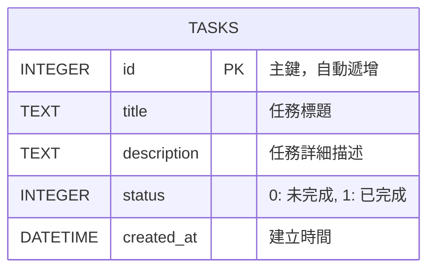

# 資料庫設計 (DB Design)

本系統使用 SQLite 作為資料儲存方案。為了達成任務管理的需求，我們只需要一個主要的資料表 `tasks`。

## 1. ER 圖（實體關係圖）



## 2. 資料表詳細說明

### 資料表名稱：`tasks`

| 欄位名稱 | 型別 | 屬性 | 說明 |
| :--- | :--- | :--- | :--- |
| `id` | INTEGER | PRIMARY KEY, AUTOINCREMENT | 每一筆任務的唯一識別碼 |
| `title` | TEXT | NOT NULL | 任務的名稱，使用者必填項目 |
| `description` | TEXT | NULL | (保留擴充用) 任務的詳細說明 |
| `status` | INTEGER | DEFAULT 0 | 記錄任務完成狀態，0 代表「未完成」，1 代表「已完成」。由於 SQLite 原生不支援 Boolean 型別，我們使用 Integer 來代替。 |
| `created_at` | DATETIME | DEFAULT CURRENT_TIMESTAMP | 記錄任務被新增的時間，由資料庫自動產生 |

## 3. SQL 建表語法

請參考 `database/schema.sql`，以下為建立 `tasks` 資料表的原生 SQL 語法：

```sql
DROP TABLE IF EXISTS tasks;

CREATE TABLE tasks (
    id INTEGER PRIMARY KEY AUTOINCREMENT,
    title TEXT NOT NULL,
    description TEXT,
    status INTEGER NOT NULL DEFAULT 0,
    created_at DATETIME DEFAULT CURRENT_TIMESTAMP
);
```

## 4. Python Model 程式碼設計

我們將在 `app/models/task.py` 實作資料庫的封裝層，負責處理與 `tasks` 資料表有關的 CRUD 操作：

- `get_db_connection()`: 連線到 `instance/database.db`，並設定 `sqlite3.Row` 使回傳資料能用字典 (dict) 方式讀取欄位。
- `get_all(status=None)`: 取得所有任務清單。若有給定狀態，則依照狀態過濾。
- `get_by_id(task_id)`: 依 ID 取得單筆記錄。
- `create(title, description=None)`: 新增一筆任務。
- `update(task_id, title, description)`: 更新任務的文字內容。
- `toggle_status(task_id)`: 切換任務的狀態 (0 變 1，1 變 0)。
- `delete(task_id)`: 刪除指定的任務。
