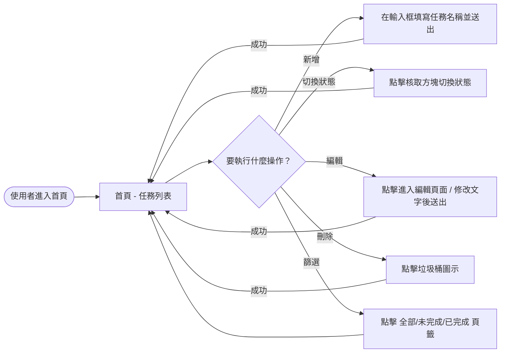
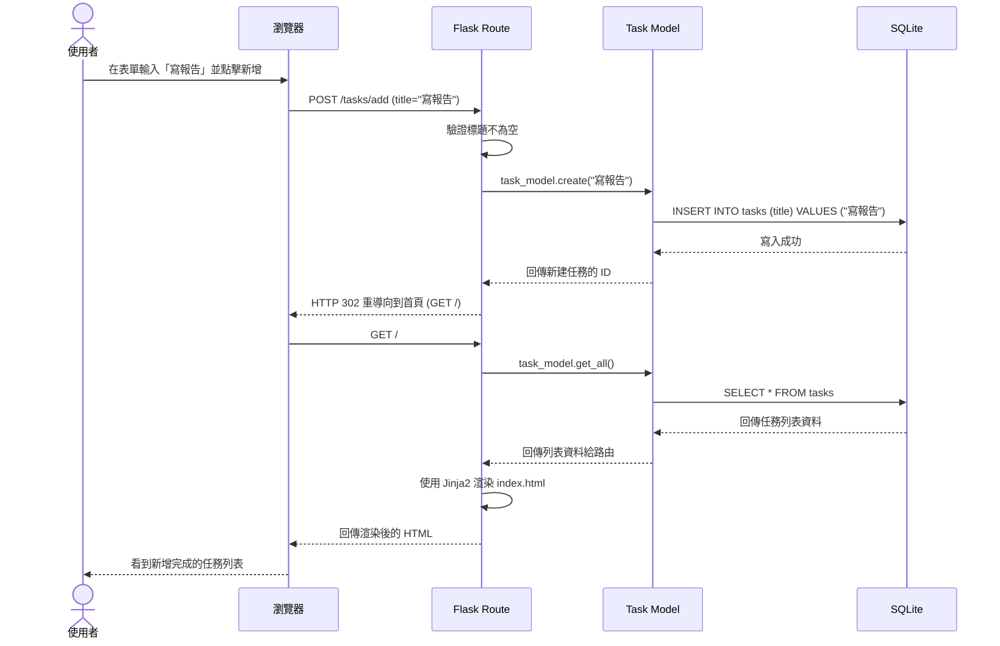

# 流程圖設計 (Flowchart)

本文件使用 Mermaid 語法描述使用者的操作路徑與系統內部的資料流向。

## 1. 使用者流程圖 (User Flow)

此流程圖展示了使用者進入網站後，可以進行的各項任務管理操作：

## 2. 系統序列圖 (Sequence Diagram)

此圖描述當使用者「新增一個任務」時，系統各個元件如何互動與傳遞資料：

## 3. 功能清單對照表

此表對應了使用者操作與即將實作的 HTTP 路由：

| 功能操作 | HTTP 方法 | URL 路徑 | 對應邏輯與說明 |
| :--- | :--- | :--- | :--- |
| **顯示任務列表** | GET | `/` | 查詢所有任務並渲染首頁清單 (可帶狀態過濾參數) |
| **新增任務** | POST | `/tasks/add` | 接收表單傳來的 `title`，寫入資料庫並重導向首頁 |
| **切換完成狀態** | POST | `/tasks/<id>/toggle` | 更新指定 ID 的 `status` 欄位並重導向首頁 |
| **編輯任務頁面** | GET | `/tasks/<id>/edit` | 顯示該任務的修改表單頁面 |
| **更新任務內容** | POST | `/tasks/<id>/edit` | 接收修改後的 `title`，更新資料庫並重導向首頁 |
| **刪除任務** | POST | `/tasks/<id>/delete` | 刪除指定 ID 的任務記錄並重導向首頁 |
